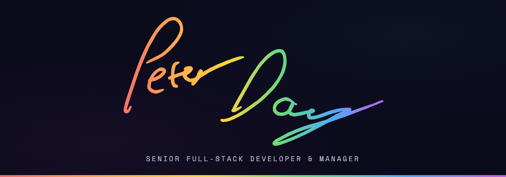

  

 

  &nbsp;
  &nbsp;
  

 

  &nbsp;
  &nbsp;
  

 

  

---

🧑‍💻 Senior full-stack engineer with **15+ years** building high-availability, customer-facing platforms. Currently at **Experian** working on **RiskScreen** — an AML platform for sanctions, PEPs, and adverse media screening. Ex-CTO at **Quuu**, where I rebuilt the entire platform end-to-end, introduced CI/CD and TDD, and drove production incidents to zero.

🏳️‍🌈 Proud member of the LGBTQ+ community. Happiness is the most important thing in this world and we could all do with a lot more of it! ❤️

---

### 🛠️ `CORE SKILLS`

| 🔴 Backend | 🔵 Frontend | 🟢 DevOps & Cloud | 🟣 AI & Automation |
|:--------|:---------|:---------------|:----------------|
| PHP 8.4 | Vue 3 | AWS (EC2, RDS, S3) | OpenAI APIs |
| Laravel 12 | Tailwind | Docker | Naive Bayes ML |
| REST APIs | Nuxt | Linux | NER Models |
| Redis | React | CI/CD | Puppeteer |
| MySQL | SPA/PWA | Nginx | Headless Automation |
| Queues (SQS) | SCSS | GitHub Actions | |
| TDD | | | |

  

---

### 🚀 `SELECTED PROJECTS`

🟣 **[Quuu](https://quuu.co/)** — Full rebuild to Laravel 12 + Vue. Teams, Pods, RSS, extensions, AI content tools. Featured by Forbes, HuffPost, HubSpot, and Hootsuite.

🟠 **[Rasdio](https://rasdio.co.uk/)** — Charity internet radio with annual 24-hour livestreams raising tens of thousands for charity. 🎙️

🟢 **[The BBQ Society](https://thebbqsociety.co.uk/)** — Custom Laravel 11 + Vue e-commerce using the in-house "Cooker" framework. 🔥

🔵 **[Mentioned.ai](https://mentioned.ai)** — Custom NER model to match names to contacts across the web. 🤖

🟡 **[MagicBlog.ai](https://magicblog.ai)** — AI blog generation to WordPress. Built on Laravel 10, later sold. ✨

---

### 📦 `OPEN SOURCE`

| | Package | Description |
|:-:|:--------|:------------|
| 🔴 | [**docudoodle**](https://github.com/genericmilk/docudoodle) | AI-powered codebase documentation tool aimed at legacy applications |
| 🟠 | [**cooker**](https://github.com/genericmilk/cooker) | Laravel-based e-commerce framework powering production storefronts |
| 🟢 | [**ical-tools**](https://github.com/genericmilk/ical-tools) | CLI tools for working with iCal files and calendar workflows |
| 🔵 | [**uwus**](https://github.com/genericmilk/uwus) | AI-generated radio news bulletin tooling for Rasdio |
| 🟣 | [**Laravel Herd**](https://github.com/laravel/herd) | Contributions to the first-party Laravel local dev environment |

   
  

---

### 💼 `EXPERIENCE`

🔴 **Software Developer** · Experian · `2026 — Present`
> 🛡️ Working on RiskScreen, an AML platform for sanctions, PEPs, and adverse media screening.

🟠 **Senior AI Developer** · A.V. Rillo R&D · `2025 — 2026`
> 🤖 AI-powered QA workflows, legacy code extraction tooling, and automated headless browsing.

🟣 **CTO → Senior Developer** · Quuu · `2018 — 2025`
> ⚡ Re-architected the entire platform (Laravel 12 + Vue), shipped Teams, Pods, RSS, Chrome extensions, and AI features. Zero production incidents.

🔵 **Web Developer** · Park Holidays UK · `2015 — 2018`
> 🏖️ Internal tools, social network rebuild, main site rebuild on AWS.

---

  
  

---

  

---

  🌸 Built with care from Gloucester, UK · <a href="https://peterday.uk">peterday.uk</a>

